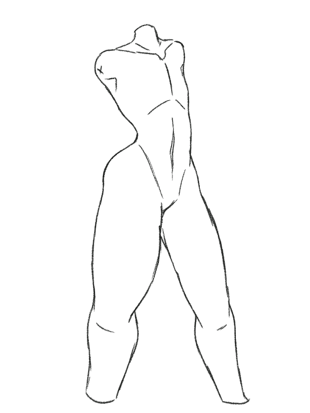
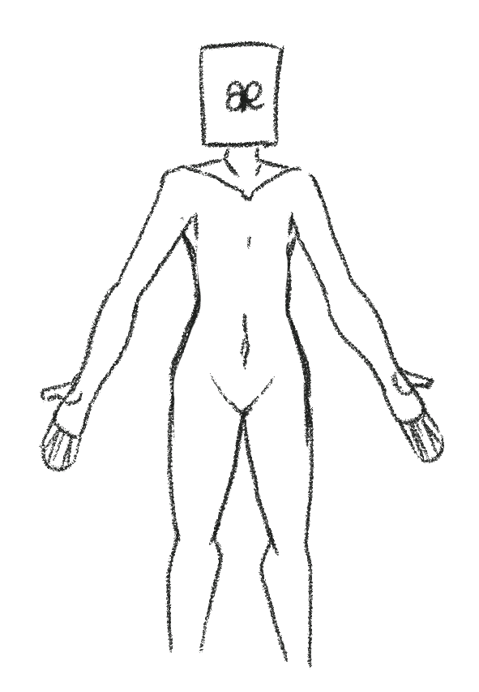
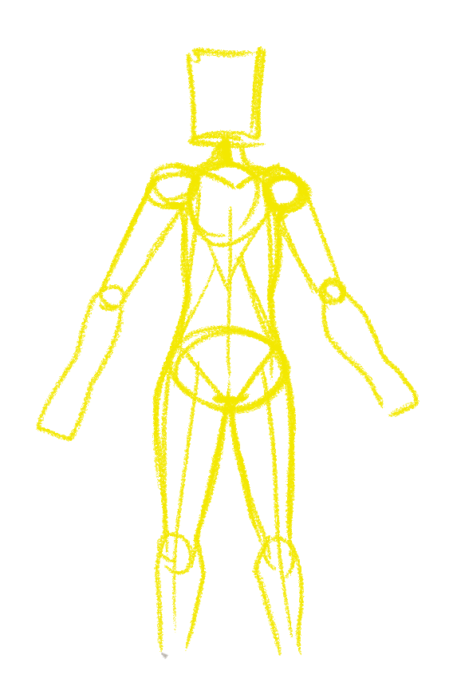

## Practicing drawing body drawing without reference.

Welcome to my first *real* blog. I've been wanting to get good at drawing the body, so I decided to practice drawing it without reference. In past practice I've sort of figured out the shapes that make it up so I wanted to try to apply that.

Here are my most sucessful attempts:

I'm aware that failing is part of the process, but there's still something inherently embarrasing about it. There's at least 2 full photoshop pages of 'failure' before these successful attempts.

For the first one I started off by using a technique I learnt from youtube user MikeyMegaMega, in a video where he shows how to achieve anime body proportions. Basically you start off with the shoulder line and neck, and then extend a spine downwards adding in a ribcage and pelvis bone-area. Then, you connect these segments by creating the stomach region. This was pretty successful, but with this technique I struggle in connecting arms.

The second technique is an amalgamation of multiple short tutorials I found on tumblr. I started off with two circles, one for the upper torso / ribcage and one for the lower torso / pelvis. Then, I connected them using lines I just sort of intuitively came up with. The arms I am a fan of -- the sketch doesn't do it justice, but in the 'final' version it looks pretty decent; I started off by simply adding a circle where I thought the elbows would be, and then connecting them to the shoulders with a straight line. Then, I created a sort of figure-eight shape to create the forearm + hands. Again, this was mostly intuitive. The legs are simple lines following the form downward which then follow the curve of the hips.

I'm by no means an expert in this, or nearly as good as I want to be, but hopefully doing this practice regularly will enable me to finally figure this out, and maybe even get a unique style. I'm still just starting out.

If anyone is reading this and has any tips on how to improve, feel free to eMail me. Have a great day!
